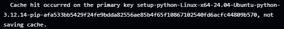

# devops-eval

Une API Flask connectée à Postgres, conteneurisée et déployée automatiquement via GitHub Actions, avec des métriques Prometheus.

## Architecture

- `app/` : l'API Flask, avec les endpoints `/health`, `/visit` et `/metrics`
- `Dockerfile` : build multi-stage sur `python:3.12-slim`, l'application tourne avec un utilisateur non-root et un HEALTHCHECK
- `docker-compose.yml` : trois services, `app`, `db` pour Postgres et `prometheus`
- `.github/workflows/ci.yml` : lint, tests sur une matrix Python 3.11 et 3.12 avec un vrai service Postgres, build de l'image, et un job `ci-ok` qui doit être vert
- `.github/workflows/cd.yml` : construit l'image, la pousse sur GHCR avec trois tags, puis la déploie sur un runner self-hosted, avec vérification post-déploiement et rollback automatique
- `.github/actions/setup-python-deps/` : une action locale réutilisable qui installe Python, active le cache et installe les dépendances
- `prometheus/` : la configuration de scrape et les règles d'alerte

## Lancer le projet en local

```bash
git clone https://github.com/Madaaaaaaaaaaaaaa/devops-eval.git
cd devops-eval
docker compose up --build
curl localhost:8000/health
curl -X POST localhost:8000/visit
curl localhost:8000/metrics
```
Prometheus est accessible sur http://localhost:9090/alerts

## Les endpoints

`GET /health` vérifie que la base répond et renvoie 200 ou 503 selon le résultat.
`POST /visit` incrémente un compteur de visites stocké en base.
`GET /metrics` expose les métriques au format Prometheus.

## Métriques exposées

`http_requests_total` compte les requêtes reçues, avec les labels endpoint et code.
`http_request_duration_seconds` est un histogramme de latence par route, il permet de calculer p95 et p99.
`app_version_info` est une jauge qui expose le SHA du commit actuellement déployé.

## Les règles d'alerte

La première, HighErrorRate5xx, se déclenche quand plus de 5% des réponses sont des 5xx pendant 5 minutes. Ce seuil capte une vraie dégradation sans réagir à un pic isolé, et la fenêtre de 5 minutes évite les faux positifs.

La seconde, HighLatencyP95, se déclenche quand le p95 de latence dépasse 500 ms pendant 10 minutes. Ce seuil correspond à une lenteur perceptible pour l'utilisateur, et la fenêtre plus longue tient compte du fait que la latence varie davantage que le taux d'erreur.

## La CI

Quatre jobs s'enchaînent : lint avec flake8 et yamllint, test sur la matrix Python avec un service Postgres réellement utilisé par les tests, build qui construit l'image, et ci-ok qui doit être vert pour que le merge sur main soit autorisé.

## La CD

Elle se déclenche sur un push vers main, après que la CI soit passée via workflow_call, ou manuellement via workflow_dispatch avec l'environnement production en entrée. Elle construit et pousse l'image sur ghcr.io avec trois tags: latest, le SHA court du commit et un tag semver. Elle déploie ensuite sur le runner self-hosted, vérifie que l'application répond bien sur /health avec trois tentatives, et déclenche un rollback automatique vers le SHA précédent si le déploiement échoue.

## Secrets et permissions

Chaque workflow déclare ses permissions explicitement en tête de fichier, selon le principe du moindre privilège. Le GITHUB_TOKEN fourni par GitHub suffit pour s'authentifier sur GHCR, aucun secret supplémentaire n'est nécessaire.

## Le runner self-hosted

Un runner GitHub Actions tourne sur une machine Ubuntu, avec Docker installé, pour exécuter réellement le déploiement.

## Preuve du cache


